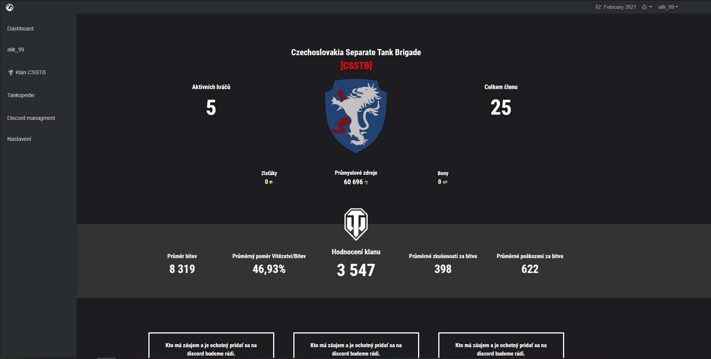

![version-shield]
![languages-shield]
.
<!-- PROJECT LOGO -->
 

  

  <h3 align="center">WoT CIS</h3>

  

    World of Tanks Clan Information System
     
    <a href="http://wot-cis.alespavlik.cz/WoT-CIS.pdf"><strong>Stahnout si PDF 📥</strong></a>
     
     
    <a href="http://alespavlik.cz">Autor projektu</a>
    ·
    <a href="https://worldoftanks.eu/">World of Tanks</a>
    ·
    <a href="https://github.com/AlekiCreative/WorldOfTanks_CIS/issues">Issues</a>
  

<!-- TABLE OF CONTENTS -->
<ol>
    <li><a href="#o-projektu">O projektu</a></li>
    <li><a href="#historie-vývoje">Historie vývoje</a></li>
    <li><a href="#screenshoty">Screenshoty</a></li>
    <li><a href="#použitá-technologie">Použitá technologie</a></li>
    <li><a href="#license">License</a></li>
    <li><a href="#autor">Autor</a></li>
</ol>

<!-- O projektu -->
## O projektu

World of Tanks Clan Information System je nástroj pro zjednodušení správu klanu. 
WoT CIS není vyvíjen ani financován společnosti Wargaming. Projekt je vyvíjen pod licencí GNU General Public License v3.0 viz LICENSE. 
Design je inspirován officiálním webem World of Tanks 
 
Použivání na vlastní riziko, autor nenese žádnou odpovědnost za škody ani za únik dat

### Funkce
<ul>
    <li>Statistika klanu</li>
    <li>Plánování eventu</li>
    <li>Správá klanového Discord serveru</li>
    <li>Informace o členech</li>
</ul>

<!-- Historie vývoje -->
## Historie vývoje

  
0.1 Zahájen vývoj (2. Února 2021)

  <li>Základní grafický podklad </li>
  <li>Základní struktura souboru </li>

  
0.2 (3. Února 2021)

  <li>Grafický návrh (Osobní dashboard) </li>
  <li>Změny v sidebar (Přidani odkazy na grafické návrhy) </li>

  
0.3 (9. Února 2021)

  <li>odkazy v sidebar</li>
  <li>nehotové substránky jsou skryté</li>
  <li>grafický návrh clan-personal, player-garage, clan-board, about, setting</li>
  <li>dočasně skryt notifikační zvoneček v liště</li>
  <li>přidán odkaz na WoT profil na officiálních strankách hry, v nabídce navigační listy</li>

 
<!-- Screenshoty -->
## Screenshoty

<!-- Použitá technologie -->
## Použité technologie, knihovny, frameworku
* [Font Awesome](https://fontawesome.com)
* [Bootstrap](https://getbootstrap.com)
* [JQuery](https://jquery.com)
* [Wargaming-auth-api-php](https://github.com/viktorsgolubevs/Wargaming-auth-api-php)

## Pracuje se na

*	Grafický návrh
*	Optimalizace css

<!-- LICENSE -->
## License

Distributed under the GNU General Public License v3.0. See `LICENSE` for more information.

<!-- Autor -->
## Autor
<h3 align="center">Aleš "Aleki/Garfield" Pavlík</h3>

  
  
  
   
  
  
  
   
  
  
  
  
  
  
  

[version-shield]: https://ctrlv.cz/shots/2021/02/01/pBqP.png
[languages-shield]:https://ctrlv.cz/shots/2021/02/01/upMD.png
